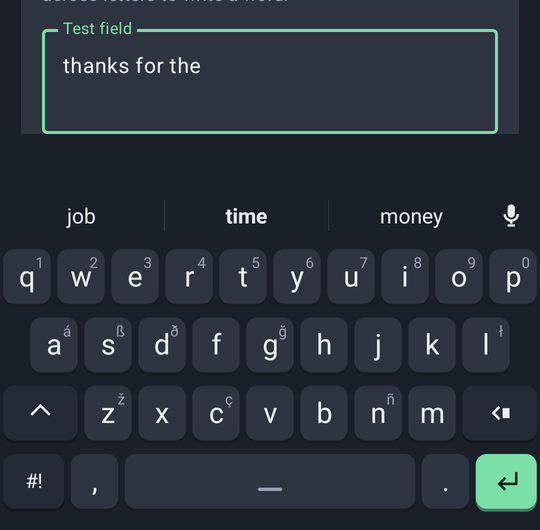
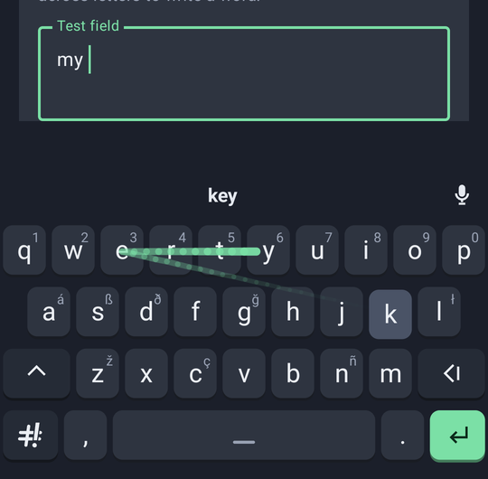
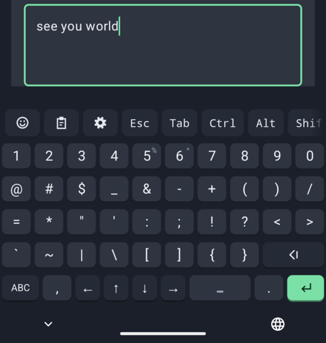
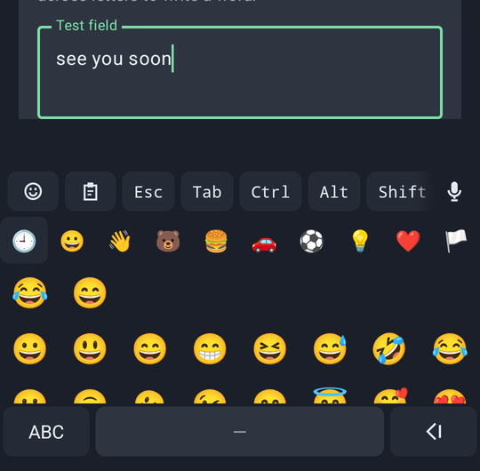
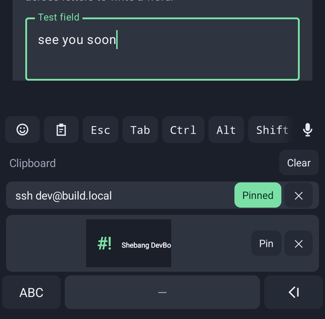
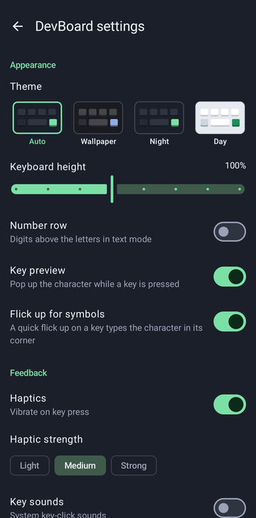

# Shebang DevBoard

An Android keyboard (IME) for developers, written in Kotlin.

- **Text mode**: QWERTY with suggestions, long-press alternates (a letter's capital first) and
  auto-capitalisation, and glide typing
  that decodes while the finger moves: the strip shows the word before you lift; the word before is taken
  into account; tap inside a word (or double-tap it) and glide to redo it; the keyboard learns your words
  and how you swipe, on the phone; and (optionally) one stroke can write several words by dipping into the
  space bar between them.
- **Code mode** (`#!` key): every digit and printable ASCII symbol on one page, plus arrow keys. The two rows
  under the digits are the usual phone symbol page's (`@ # $ _ & - + ( ) /`, then `= * " ' : ; ! ? < >`), the
  code extras (`` ` ~ | \ [ ] { } ``) the row below, and backspace, comma, space, period and enter sit where
  they do in text mode; `%` and `^` are held on 5 and 6. No shift, no autocorrect.
- **Terminal bar**: a horizontally scrolling strip of terminal keys (Esc, Tab, Ctrl, Alt, ^C, arrows, F1-F12,
  snippets...) that sends real `KeyEvent`s, so Termux and other terminals receive them. Sticky modifiers let
  `Ctrl` then `c` on the main keyboard send Ctrl+C. Its first two items open the emoji panel and the
  clipboard history (text and pictures, with pins).
- **Autocorrect that knows where you tapped**: a slip is weighed by where the finger came down, and the
  keyboard learns where your own taps land on each key.
- **Field-aware**: terminals (`TYPE_NULL`) get raw characters and no composing; passwords get no
  suggestions or glide; number/phone/date fields get a numeric pad; email fields get `@` in place of the comma (also fields whose hint asks for an email), web-address fields `/` and `@`.
- **Email addresses** typed into email fields are offered there again as you type, and **Export
  diagnostics** saves a file you can send the developer, with nothing personal in it.
- **Autofill in the strip** (Android 11+): the password manager's or autofill service's suggestions show as
  chips in the strip, in the keyboard's colours; tapping one fills the form.
- **On-device only**: the sole permission is `VIBRATE`. No network code, no analytics. What the keyboard
  learns (word counts, word pairs, swipe offsets) stays in the app's private files, can be reviewed and
  deleted in Settings > Personal words, and is never taken from password, number, email, URL, terminal or
  no-suggestion fields, or fields that ask for no learning. The one exception is email addresses typed into
  email fields, which are remembered so the strip can offer them again (Settings > Learning > Remember email
  addresses turns this off).

## Screenshots

| | | |
|---|---|---|
|  |  |  |
| Next-word suggestions from the whole sentence | Glide typing: the trail, and the word read before you lift | Code mode: every symbol on one page |
|  |  |  |
| The emoji panel, from the terminal bar | Clipboard history with pins and pictures | Settings (Night theme) |

## Build and install

Requirements: JDK 17+ (21 used here), Android SDK with platform 36 and build-tools 36, and for Shebang Voice
NDK 29.0.14206865 and CMake 4.1.2 (CI installs exactly these). Gradle is fetched by the wrapper.

```sh
tools/fetch_voice_model.sh             # Shebang Voice's speech model (57 MB, not in git); its build needs it
./gradlew assembleDebug test lint      # what CI runs (.github/workflows/android.yml)
./gradlew installDebug                 # install on the connected device or emulator
adb shell ime enable dev.shebang.devboard/.ime.DevBoardService
adb shell ime set dev.shebang.devboard/.ime.DevBoardService
```

Or open the **Shebang DevBoard** launcher entry and follow its three steps (enable, select, test).

Rebuilding the word list, the word statistics and the models: [docs/data-and-models.md](docs/data-and-models.md).

## Layout of the code

| Package (`dev.shebang.devboard.`) | What lives there |
|---|---|
| `ime` | `DevBoardService` (the `InputMethodService`), `FieldInfo` (EditorInfo -> what the field allows), `TextInputController` (composing, suggestions, smart spacing, redoing a tapped word, what is learned when), `GlideText` (context word and casing), `LanguageLoader` and `LanguageBuilder` (background load and rebuilds with learned words), `SystemUserDictionary` (Android's personal dictionary), `ClipboardHistory` and `ClipboardChip`, `EmailMemory` (remembered addresses), `VoiceClient` (the Shebang Voice add-on) and `DictationCleanup`, `LayoutRepository`, `KeyboardSizing`, `Feedback` |
| `layout` | JSON models (`LayoutDef`, `KeyDef`, `BarItem`), `LayoutParser`, `KeyboardGeometry` (pixel positions computed at runtime), `KeyCodeNames` |
| `view` | `KeyboardView` (one Canvas-drawn view with its own multitouch), `KeyPopup` (preview and alternates), `KeyIcons` (the key glyphs), `TerminalBarView`, `SuggestionStripView`, `AutofillStripView`, `TopStripView`, `EmojiPanelView`, `ClipboardPanelView` and `PanelKeys`, `MicButton`, `KeyboardTheme` and `Palettes` |
| `input` | `ModifierState` (sticky modifier state machine), `CharKeyCodes` and `KeyEventPlan` (character -> keycode plans), `KeySender` (down/up KeyEvents with meta state) |
| `glide` | `LexiconTrie` (the dictionary as a tree of key sequences), `StreamingGlideDecoder` (beam search while the finger moves, exact re-alignment after lift, joint decoding across words), `GlideModel` (the learned reading of strokes), `GlideSession` (decoder thread fed by a lock-free ring), `GlideAdaptation` and `TapModel` (where this user's glides and taps land), `GlideTrace` (recorded glides), `KeyLayoutModel` |
| `dict` | `Dictionary` (sorted word list with tiers), `PersonalWords` (learned words), `NgramModel` (word, word-pair and three-word statistics), `NextWordModel` (the neural next-word model), `WordPredictions` (the strip's next words from both), `Suggester` (prefix completion + edit-distance correction), `LetterPrior` |
| `store` | `JsonFile`: how the learned words, adaptation, emails and clipboard history are saved (atomic writes; an unreadable file set aside, never overwritten) |
| `settings` | `Settings`, `SettingsRepository` (DataStore), `SetupActivity`, `SettingsActivity` with the bar editor and the glide recorder (Compose + Material 3), `PersonalWordsScreen`, `AboutScreen`, `DiagnosticsExport`, `AppProfiles` (each app's mode and bar), `GlideRecorderView`, `GlideTraceStore` |

The Shebang Voice add-on is the `voice` module (`dev.shebang.devboard.voice`); see its section below.

Layouts live in `app/src/main/assets/layouts/*.json`, the default terminal bar in `assets/bar/default.json`,
the word list in `assets/dict/en_words.txt`, the n-gram model in `assets/dict/en_ngrams.bin`, the next-word model
in `assets/dict/en_next_word.bin` and the glide model in `assets/glide/glide_model.bin`.

## Documentation

- [Glide typing and learning](docs/glide-and-learning.md): how a stroke is decoded, the benchmarks, and what
  the keyboard learns on the phone.
- [Decisions](docs/decisions.md): every choice that was not obvious, with its reason and measurements.
- [Data and models](docs/data-and-models.md): rebuilding the word list, word statistics and models.
- [Shebang Voice](docs/voice.md): the speech add-on.
- [Manual checklist](docs/manual-checklist.md): what to check by hand, and what has been.
- [Design language](docs/design-language.md): the themes, keys and pages.
- [Privacy policy](PRIVACY.md) and [credits](THIRD_PARTY_NOTICES.md).
- The [wiki](https://github.com/aquilaelabs/Shebang-DevBoard/wiki) is the guide for people using the keyboard.

## Shebang Voice (add-on)

Speech typing comes as a separate app, `voice/`, so the keyboard keeps VIBRATE as its only permission and
has no network code; the add-on holds the microphone permission and has no network access either. It works
on the owner's Pixel (about 5 s from a pause to the text before flash attention and the shorter pause); speed
there is still being measured (R15). It
runs OpenAI's Whisper (base.en, 5-bit, 57 MB, MIT) through whisper.cpp (vendored, CPU only). Fetch the
model before building it: `tools/fetch_voice_model.sh`. `./gradlew :voice:connectedDebugAndroidTest`
transcribes a public-domain recording on a device: on the emulator (2 cores, AVX2) the 11 s Kennedy sample
comes out word for word in 15 s, against 28 s without AVX2. Speed on phones is still to be measured and
tuned (ARM instruction sets chosen at runtime).

More in [docs/voice.md](docs/voice.md).

## About and updates

Settings > About shows the version, the licence, the credits and the privacy policy (`LICENSE`,
`THIRD_PARTY_NOTICES.md` and `PRIVACY.md`, copied into the app's assets at build time by the `copyAboutDocs`
task, so the app always carries the same text as the repository; `PRIVACY.md` is also the policy's public
address for app stores), and links to the source on GitHub. There is no Check for updates (the owner's
decision, with Google Play in view: Play allows updates only through Play); a newer release is installed from
the GitHub releases page or, once it is there, from Play. The app does not download or install anything
itself: that would need network access and the install-packages
permission, which together are what Android's malware scanning looks for in a keyboard. Installing a newer
APK over the old one updates it in place, keeping settings and learned words, as long as both were signed
with the same key.

## Licence

MIT (see `LICENSE`). The data and libraries it builds on keep their own licences, all permissive or public
domain, listed with their attributions in `THIRD_PARTY_NOTICES.md`; the CC BY ones (Tatoeba, Wikinews, TSI)
ask for credit wherever the app or its data is redistributed.
